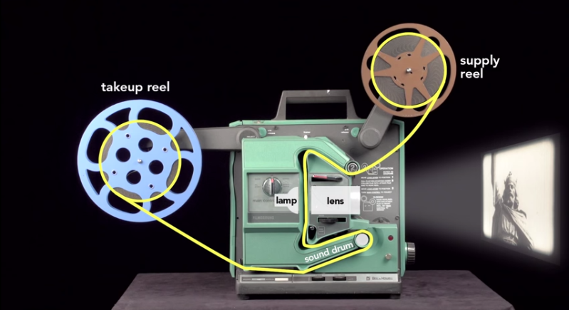
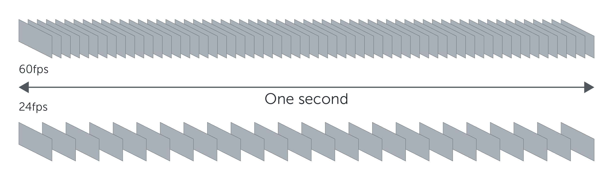
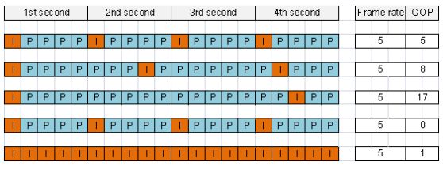

# Video Streaming
## Contents
1. What is Video
2. Video Encoding and Transcoding
3. Packaging Video for HTTP Live Streaming (HLS)
4. Playing Video Streams with HTML5 and hls.js
5. Latency concerns
6. Other formats

## What is video?

### The Zoopraxiscope

- A primitive version of later motion picture devices which worked by showing a sequence of still photographs in rapid succession, providing a sense of motion. 
- Invented by British photographer Eadweard Muybridge (1879).

<div>


</div>

### The Projector (35mm)
<div>

</div>
<div>

</div>

### Digital
 - Digital video is an electronic representation of moving visual images in the form of encoded digital data.


FPS



```
$ ffprobe -i img/gif/got.gif 
...
Input #0, gif, from 'img/gif/got.gif':
  Duration: 00:00:01.60, start: 0.000000, bitrate: 4926 kb/s
    Stream #0:0: Video: gif, bgra, 500x281, 5 fps, 5 tbr, 100 tbn, 100 tbc
```
```
$ ffmpeg -i img/gif/got.gif img/gif/got%02d.png
```

8 / 1.6s = 5fps

24fps
- This is the standard for movies and TV shows, and it was determined to be the minimum speed needed to capture video while still maintaining realistic motion.
- Even if a film is shot at a higher frame rate, it’s often produced and displayed at 24fps.

30+fps
- Videos with a lot of motion, such as sports, will often benefit from the extra frames per second.

## Video Encoding and Transcoding
<ins>Compression</ins>
- A Video Codec is software based on an algorithm that allows for compression or decompression of digital video.
- Video compression is the process of encoding a video file in such a way that it consumes less space than the original file and is easier to transmit over the network.
- H.264 is a digital video compression standard that uses half the space of MPEG-2 (the DVD standard) to deliver the same quality video.

<ins>Group Of Pictures (GOP) and Key Frames</ins>

- The length of the GOP stands for the number of frames between two
I-frames. 



- By default, the Frame Rate and length of GOP have the same value in our
cameras. 
- By increasing the length of GOP, there will be less I-frames per a certain amount of time. 
- The main benefit of using higher GOP length is to minimize bandwidth consumption and minimize storage space consumption (reduce bitrate) under same frame rate. 
- Transcoding is taking already-compressed (or encoded) content; decompressing (decoding) it; and then altering and recompressing it.

## Encoding and Packaging Video for HTTP Live Streaming (HLS)

- HTTP Live Streaming is a HTTP-based communications protocol. Originally implemented by Apple as part of its QuickTime, Safari, OS X, and iOS software.
- HLS works by breaking the overall stream into a sequence of small segments. 
- A list of available streams, encoded at different bit rates, is sent to the client using an M3U8 playlist.
- Adaptive Bitrate Streaming (ABR)
- Wowza is an example software based off the shelf solution for segmenting and packaging HLS video and audio. It will also act as a the origin webserver to deliver the content over HTTP.

### ffmpeg
Written in C - open source https://github.com/FFmpeg/FFmpeg

https://ffmpeg.org/download.html

Install static version

https://johnvansickle.com/ffmpeg/releases/ffmpeg-release-amd64-static.tar.xz

### Examples
Convert from 1 container format to another
```
$ ffmpeg -i BigBuckBunny.mp4 -vcodec copy BigBuckBunny.avi
$ ffmpeg -i BigBuckBunny.mp4 -b:v 1000k BigBuckBunny.avi
```
Clip part of a video
```
$ ffmpeg -ss 00:15:40 -i got.mkv -ss 00:01:00 -t 00:00:30 -map 0:0 -map 0:2 got.mp4
```
Extract frames from video
```
$ ffmpeg -i got.mp4 got%02d.png
```
Show details about the Container
```
$ ffprobe -i video/got.mp4 
```

### ffmpeg to stream hls
Transcode to different bitrates.
```
ffmpeg -i video/got.mp4 \
    -preset veryfast -g 24 -sc_threshold 0 \
    -map v:0 -c:v:0 libx264 -b:v:0 600k \
    -map v:0 -c:v:1 libx264 -b:v:1 1000k \
    -map a:0 -map a:0 -c:a aac -b:a 128k \
    -f hls -hls_time 5 -hls_playlist_type vod \
    -master_pl_name master.m3u8 \
    -var_stream_map "v:0,a:0 v:1,a:1" ./dist/video/stream_%v.m3u8
```

-c:v libx264 Encode Video using x264.

-c:a aac Encode Audio as AAC.

-b:v The Video Bitrate.

-b:a 128k The Audio Bitrate.

-g 24 Sets the group size to 24. The video source has 24 FPS. So each second will start with a new picture group. This option forces a target size of 24 frames. After that a new group will be created (starting with a new I-Frame).

-f hls Output Format HLS.

-hls_time Target duration for each segment.

-hls_playlist_type vod Video On Demand.


## Playing Video Streams with HTML5 and hls.js
### hls.js
https://github.com/video-dev/hls.js
https://github.com/video-dev/hls.js/blob/master/docs/API.md
https://www.npmjs.com/package/hls.js

### Setup
For this demo Typescript and the [Gulp](https://gulpjs.com/) build system has been used.

Build and deploy
```
$ gulp
$ gulp copy-html
$ sudo ./deploy.bat
```

## Latency concerns


## Other formats

- FLASH is Dead!
- Web RTC?

<ins>CMAF - Common Media Application Format</ins>
- By splitting segments into chunks, a streaming server can make chunks within a segment available already while the entire segment has not been completed yet. 
- This changes the situation as players can download the individual chunks ahead of time, and buffers can be filled faster. This allows a reduction of the end-to-end latency significantly.

## Useful links
https://elearningindustry.com/how-digital-video-works-digital-video-101

https://www.quora.com/Are-videos-just-lots-of-photos

https://fast.wistia.net/embed/iframe/bzujp1kl5e?dnt=1#?secret=buKnFpXq7U

https://youtu.be/mohF7rdX6Gk

https://engineering.giphy.com/how-to-make-gifs-with-ffmpeg/

https://trac.ffmpeg.org/wiki/StreamingGuide

http://flutterwow.com/zoopraxiscope/

http://commondatastorage.googleapis.com/gtv-videos-bucket/sample/BigBuckBunny.mp4

https://www2.acti.com/support_old/Package/%7B6060C79F-2A5D-40A4-8837-16B835E3364.PDF

https://www.akamai.com/us/en/multimedia/documents/white-paper/low-latency-streaming-cmaf-whitepaper.pdf

https://www.martin-riedl.de/2018/08/24/using-ffmpeg-as-a-hls-streaming-server-part-1/


